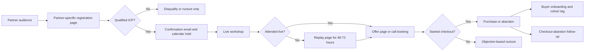
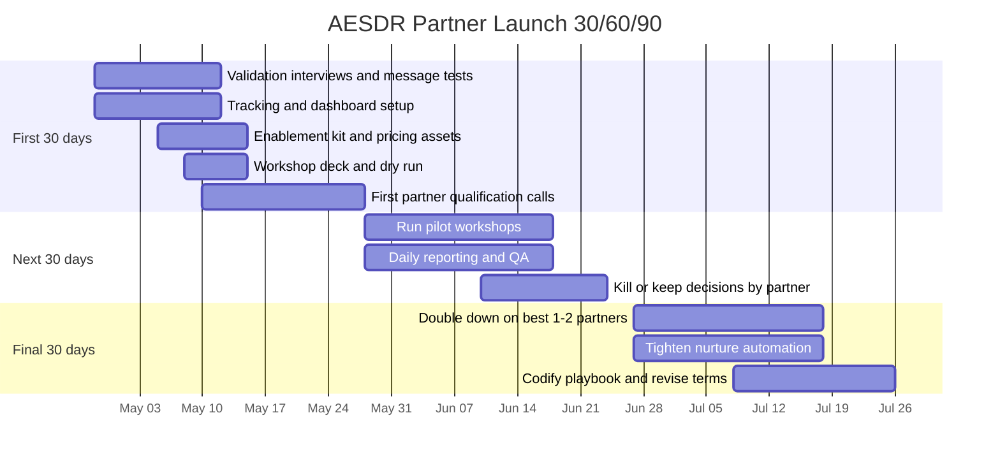

# Operational Pre-Launch Checklist for AESDR Partner Outreach

## Executive summary

Official founder-sales guidance from entity["organization","Techstars","startup accelerator"], entity["organization","SaaStr","saas community"], and entity["organization","Y Combinator","startup accelerator"] points in the same direction: before you borrow anyone else’s audience, the founder should first learn the market directly, narrow the ICP, document the sales process, and manually recruit initial users. Early-stage sales learning is too important to delegate, founders should close the first 10–20 customers themselves to learn objections and what resonates, and early user acquisition will often be deliberately unscalable at first. citeturn14view0turn14view1turn14view3turn15search0

For AESDR, that means no influencer or community outreach until five things are true: the value proposition has been tested with real early-career SDR/AE conversations, the funnel is instrumented end-to-end, the partner kit is ready, the workshop pilot is rehearsed, and compliance controls are in place. Measurement should be built around partner-specific UTMs, key events and conversions, partner/cohort tagging, funnel analysis, and cohort tracking; compliance should assume required affiliate disclosures, advertiser monitoring, email compliance, and separate seller-specific consent if SMS is used. citeturn19view2turn18view3turn19view0turn18view0turn18view2turn12view0turn12view1turn4view9turn5view0turn5view2

The recommended operating model is narrow and manual: recruit a handful of tightly aligned partners, run one workshop-first pilot per partner, compare conversion quality rather than vanity reach, and keep every pilot non-exclusive and time-boxed. In other words: less “affiliate empire,” more “founding vineyard.” Small rows, careful pruning, honest yield. citeturn15search0turn14view2turn8search3

## Launch gates

Before outreach to any single creator or community operator, AESDR should clear the following gates. These thresholds are recommended operating defaults for a pre-revenue founder-led launch, not published industry benchmarks. They are designed to force message clarity, measurement discipline, and workshop-first validation before any borrowed trust enters the funnel. citeturn14view0turn14view2turn14view3

| Gate | Minimum standard before first outreach | Evidence that it is real |
| --- | --- | --- |
| Validation | 15–20 structured interviews across early-career SaaS SDRs/AEs and at least 5 live message tests | Notes show repeated pains, repeated objections, and repeated language that prospects themselves use |
| Offer clarity | One primary offer only for the pilot | A single price, a single CTA, a single deadline, and a single refund policy |
| Tracking | Every partner gets a unique link, code, partner_id, partner_type, and cohort_id | Test visit, test registration, test checkout, test purchase, and test refund all show correctly |
| Enablement kit | Core sales assets are packed and version-controlled | Partner receives one clean folder, not twelve mystery crumbs in Slack |
| Workshop | One live workshop deck, one dry run recording, one replay page, one CTA page | Dry run completed with timing, transitions, and CTA tested |
| Vetting | A repeatable partner scorecard exists | Same rubric used on every partner, including trust signals and audience proof |
| Commercial terms | Pilot agreement, payout logic, attribution window, and exclusivity policy are written down | One redlined template, ready for send |
| Nurture | Email, SMS if used, and manual/semi-manual social follow-up are prewritten | Cadences loaded and QA-tested |
| Reporting | One dashboard shows top-of-funnel, conversion, CAC, and cohort metrics by partner | Daily report can be reviewed in under 15 minutes |

The instrumentation layer should be simple, boring, and unarguable. If it only exists in your head, it is not a process; it is a mood. SaaStr’s guidance is blunt here: document the ICP, scripts, objection handling, and key metrics, and make sure the process lives in a CRM or equivalent tracking system. citeturn14view2

| Funnel stage | Recommended event/status | What to capture |
| --- | --- | --- |
| Partner landing-page visit | page_view plus partner UTM fields | utm_source, utm_medium, utm_campaign, utm_content, partner_id, partner_type |
| Preview click | select_content | Which asset was clicked: lesson clip, syllabus, founder bio, FAQ |
| Workshop registration | generate_lead | Role, tenure, company stage, email, optional phone, partner_id |
| Qualification | qualify_lead or disqualify_lead | ICP fit reason, disqualify reason |
| Human follow-up | working_lead | Founder call, email reply, DM reply, or workshop Q&A follow-up |
| Offer page view | view_item or view_promotion | Which offer page was viewed |
| Checkout start | begin_checkout | Offer type, promo code, partner attribution |
| Purchase | purchase and close_convert_lead | Gross revenue, net revenue, discount, partner, cohort |
| Refund or non-conversion | refund or close_unconvert_lead | Refund reason, no-buy reason |

This schema is aligned with official GA4 guidance: standardize UTMs across campaigns, use recommended lead-generation and online-sales events, verify event firing in DebugView and Realtime, and use funnel and cohort exploration to diagnose where conversion stalls. citeturn19view2turn18view3turn19view1turn19view0turn18view0turn18view2

The minimum partner enablement kit should look like this.

| Asset | Minimum content | Why it exists |
| --- | --- | --- |
| Positioning brief | Who AESDR is for, who it is not for, 3 approved claims, 3 forbidden claims | Keeps partners from freelancing your positioning into nonsense |
| Lesson preview | 10–15 minute clip plus transcript and takeaway bullets | Lets partners feel the actual caliber of instruction |
| Curriculum map | 12-course overview, lesson clusters, learning outcomes | Proves shape and seriousness of the program |
| Workshop deck | Live-session slides with speaker notes and CTA slide | Enables workshop-first selling |
| Founder bio | Short speaker intro, credibility points, startup-sales context | Helps operators introduce you cleanly |
| FAQ and objection sheet | “Why not free content,” “why now,” “who should not buy,” “reimbursement,” “time commitment” | Speeds up conversions without improvisation |
| Pricing and promo sheet | List price, pilot price, code rules, expiry, refund policy | Prevents pricing drift |
| Partner promo page | Partner-specific landing page with UTM fields and hidden attribution fields | Makes attribution sane |
| Disclosure guide | Exact copy for post, story, video, live workshop, and affiliate links | Keeps compliance visible and simple |
| Reporting sheet | What the partner will see weekly: registrations, attendance, clicks, purchases, refunds | Sets expectations before money enters the room |

That kit is not optional ceremony. It is the operational expression of two rules in the sources: document the sales process before you hand it off, and train and monitor endorsers with clear claim and disclosure guidance. citeturn14view2turn12view0turn12view1

## ICP and partner matrices

The ICP should stay narrow enough that a partner can describe the buyer in one breath. SaaStr’s official guidance is explicit: start with a narrow ICP, talk to customers relentlessly, and test whether the problem is a must-have or just another polite nod in a crowded browser tab. citeturn14view3turn14view4

| Persona | Core pain statement | Buying trigger | Typical objections | Best message angle | Best-aligned partner channels |
| --- | --- | --- | --- | --- | --- |
| New SDR in startup ramp | “I’m working hard, but nobody has explained what good actually looks like here.” | First quarter pressure, coaching gaps, startup chaos | “I can get this free online.” “I don’t have time.” | Survive ramp, understand expectations, avoid invisible unforced errors | SDR community operators, bootcamp coaches, alumni ambassadors |
| SDR aiming for AE track | “I want the real transition playbook, not generic motivation.” | Promotion timing, shadowing, missed targets, confusion about next-level behavior | “I should wait until I’m promoted.” | Build AE judgment before the title arrives | SDR/AE creators, coaches, alumni ambassadors |
| First-time AE in startup SaaS | “I know activity, but not how to manage the culture, ambiguity, and personal expectations.” | New logo responsibility, startup volatility, first bad month | “This sounds too junior.” “I already know sales basics.” | This is not generic sales training; it is startup-survival operating context | AE-focused micro-creators, community operators |
| Career-switcher in first SaaS sales role | “I didn’t grow up in this culture, and I’m learning the rules while being measured by them.” | First role, first quota, fear of washing out | “I should just learn on the job.” | Compress painful trial-and-error | Bootcamp coaches, alumni networks, micro-creators |
| Manager-sponsored buyer | “I need ramp support for junior reps without building a program from scratch.” | New cohort hire, underperforming ramp, no internal enablement bandwidth | “I can coach them myself.” “Budget is tight.” | Faster ramp and fewer avoidable mistakes for junior reps | Community operators, coach-led workshops, trusted creators with manager audiences |

The partner archetype comparison below is a practical scoring model for pre-revenue pilots. These are directional judgments inferred from narrow-ICP, founder-led, workshop-first selling logic. Treat them as hypotheses to test, not carved tablets lowered from the mountain. citeturn14view0turn14view2turn15search0

| Partner archetype | Fit to AESDR | Trust signals to verify | Expected conversion in a small workshop-first pilot | Cost profile | Recommended deal structure |
| --- | --- | --- | --- | --- | --- |
| Community operator | High if the community is role-specific and active | Live attendance history, moderated conversations, member replies, role relevance, sponsor references | Medium-to-high conversion, medium volume | Moderate | Low fixed prep fee only if past attendance is proven, plus commission; one live workshop + replay + 30-day attribution |
| Bootcamp coach | Very high | Student testimonials, office-hours attendance, alumni outcomes, direct coaching history | High conversion, lower volume | Low-to-moderate | Commission-first or fixed-against-commission; workshop + private Q&A + fast follow-up |
| Micro-creator | Variable to high if niche is exact | Comments from real reps, repeated role-specific content, live session history, audience quality over size | Medium conversion, variable volume | Low | Commission-first; no fixed fee unless they can prove workshop attendance or email list response |
| Alumni ambassador | High trust, small reach | Admin or leadership role in alumni circles, repeat referrals, known peer credibility | High conversion, very low volume | Very low | Referral code or stipend + commission; cohort- or geo-specific pilot only |
| Hybrid coach-creator | Often the strongest overall fit | Teaches, hosts, writes, and has real replies from reps | High conversion, moderate volume | Moderate | Fixed-against-commission with co-branded workshop and two follow-up sends |

## Workshop-first pilot and nurture funnel

For AESDR, the pilot motion should be workshop-first, not link-first. That approach matches the logic in the sources: founders should learn directly from early customers, manual recruitment is normal at the start, and early-stage processes should be documented around real objections and real buying moments rather than abstract affiliate optimism. citeturn14view0turn14view1turn15search0

This pilot funnel should be instrumented with partner-specific UTMs plus lead and commerce events, so AESDR can analyze source-to-purchase performance, funnel leaks, and later cohort behavior by partner. If SMS or partner-shared follow-up is part of registration, use separate, explicit consent capture for each seller rather than one mushy checkbox trying to baptize everybody at once. citeturn19view2turn18view3turn18view0turn18view2turn5view0turn5view2

The workshop itself should be designed to teach something real, not merely perfume the offer.

| Workshop component | Recommended operating standard | Suggested pass criteria |
| --- | --- | --- |
| Registration page | Pain-led title, speaker credibility, 3 outcomes, explicit who-it-is-for, role filter, partner-specific page | 20–35% visit-to-registration on warm partner traffic |
| Live content | 45–55 minutes total, with one framework, one self-assessment, one “startup reality” section, one offer | 35%+ registration-to-live attendance |
| Q&A | 10–15 minutes with real role-specific questions | At least 5 substantive ICP questions in a small pilot |
| Offer | One clear CTA only: checkout or application, not both unless price is high enough to justify calls | 5%+ attendee-to-purchase or 3+ high-intent calls booked |
| Replay | 48–72 hour gated replay with summary email and CTA above the fold | Replay contributes at least some incremental conversions; if it contributes none, fix follow-up or kill replay |
| Kill criteria | Partner sends traffic but no trust, no attendance, no engagement, or off-ICP signups | End the pilot and do not extend |

A good default workshop agenda for AESDR is this.

| Time | Segment |
| --- | --- |
| 0–5 min | Who this is for, who it is not for, what people will leave with |
| 5–15 min | The real pressures early-career reps face in startup SaaS |
| 15–25 min | The performance operating system: activity, judgment, manager communication |
| 25–35 min | Cultural and expectation traps that quietly wreck otherwise good reps |
| 35–45 min | How AESDR’s curriculum resolves those gaps |
| 45–55 min | Q&A |
| 55–60 min | Offer, deadline, bonus, and next step |

The workshop-first test criteria should also govern partner vetting. A partner passes only if they do what good partners do in the wild: promote on time, bring the right audience, ask good questions, follow the approval rules, and produce either sales or obviously sale-adjacent intent. That standard mirrors both founder-led sales logic and FTC guidance that advertisers should train, monitor, and, when feasible, pre-approve posts rather than discover problems after the horse has eaten the fence and your tomatoes. citeturn14view2turn12view1turn12view2

Automated nurture should remain light, role-specific, and event-triggered. For pre-revenue, treat entity["company","LinkedIn","professional network"] as a manual or semi-manual high-intent follow-up channel, not a spray-and-pray robot farm; this stage benefits more from hand-tuned relevance than from industrial misting. citeturn15search0

| Audience state | Timing | Channel | Content bucket | Primary metric |
| --- | --- | --- | --- | --- |
| Registered | Immediately | Email | Confirmation, calendar hold, one preview asset | Open rate, calendar add |
| Registered | 24 hours before | Email | What they will learn, who it is for, one pain statement | Open rate, reply rate |
| Registered with SMS consent | 3 hours before | SMS | Short reminder and join link | Click rate, attendance lift |
| Attended live, no purchase | Same day | Email | Summary, worksheet, CTA, deadline | CTR to offer |
| No-show | Same day | Email | Replay access with 48–72 hour expiry | Replay watch rate |
| Clicked offer, no checkout | Day 1 | Email | Objection handling: “free content vs structured coaching” | Checkout-start rate |
| Started checkout, no purchase | Day 1 | Email or SMS if consent | Friction removal: pricing, access, refund, fit | Purchase completion |
| High-intent attendee | Day 1–3 | Manual or semi-manual LinkedIn plus email | Short personal note referencing a question they asked | Reply rate, calls booked |
| Deadline window | Day 4–7 | Email, optional SMS if consent | Deadline, bonus expiry, “who should not buy” honesty note | Purchase rate |

For commercial emails, subject lines must not be deceptive and the message must include a valid postal address and a working opt-out mechanism. For marketing texts, prior express written consent is required in the relevant cases, and recent FCC one-to-one consent rules make seller-specific permission especially important when multiple parties want to message a registrant. citeturn4view9turn19view3turn5view0turn5view2

## Deals, legal controls, and dashboard

The pilot deal should be plain, short, and intentionally non-romantic. Pre-revenue is not the time for long exclusivity, permanent rev-share fog, or custom snowflake economics. Time-box the test, define the deliverables, measure the result, extend only if the result deserves extension. Direct-sales motions often begin with pilots, and founder guidance from YC and SaaStr strongly favors proving the process before scaling it. citeturn8search0turn8search3turn14view2

| Term | Recommended pilot default |
| --- | --- |
| Pilot length | 30 days |
| Structure | One live workshop, replay window, follow-up sequence, and one offer |
| Fixed fee | Default to none; add only for proven distribution or high-prep custom work |
| Commission | Meaningful commission on net collected revenue, not vague “we’ll sort it out” fumes |
| Attribution window | 14–30 days, depending on sales cycle length |
| Refund treatment | Commission paid on net revenue after refunds |
| Exclusivity | None by default; at most 30-day segment-specific exclusivity after hitting clear thresholds |
| Deliverables | Explicit count of emails, posts, webinar promos, and replay placement |
| Reporting cadence | Weekly during pilot |
| Termination | Immediate termination for compliance issues, misleading claims, or brand mismatch |

If price or access terms need a customer-facing contract, YC publishes a free SaaS sales agreement template as a starting point; for AESDR, use that for buyer-facing terms if helpful, and add a short separate partner rider for commissions, disclosures, approvals, attribution, and termination. citeturn9view0

Use a written compliance sheet based on guidance from the entity["organization","Federal Trade Commission","us regulator"] and the entity["organization","Federal Communications Commission","us regulator"]. The essentials are straightforward: disclose any material connection clearly and conspicuously; place affiliate disclosures near the recommendation or link; use clear terms like “ad,” “sponsored,” or plain-language commission disclosure; disclose in both video and audio where relevant; repeat disclosures in live streams; give partners approved claims and forbidden claims; monitor what they say; and, if monitoring is too burdensome, move to pre-approval of paid content. For SMS, obtain seller-specific written consent where required, and do not assume one form can bless every future sender in the kingdom. citeturn4view8turn12view0turn12view1turn12view2turn12view3turn5view0turn5view2

Sample affiliate or partner agreement bullet points:

- 30-day non-exclusive pilot term.
- One live workshop, one replay window, and exact promotional deliverables.
- Partner may use only approved copy, approved claims, and approved assets.
- No income claims, job-placement claims, or performance promises unless AESDR has substantiation and explicitly authorizes them.
- Required disclosure language for posts, stories, videos, lives, newsletters, and affiliate links.
- Pre-approval required for all paid placements and all ephemeral content.
- Unique tracking URL and code required for attribution.
- Attribution window, refund policy, payout timing, and treatment of coupon stacking.
- Lead-data handling rules, including whether registrant data is shared with the partner.
- Immediate termination for misleading claims, non-disclosure, spam complaints, or obvious audience mismatch.
- Recording and content rights for the workshop and replay.
- Confidential treatment of pricing and internal conversion data.

The reporting dashboard should be brutally honest. Include founder time as a cost input, or your CAC will look angelic while your calendar burns like a paper chapel.

| KPI | How to calculate it | Why it matters |
| --- | --- | --- |
| Partner response rate | Replies / outreach sent | Measures whether the partner pitch is resonating |
| Qualification rate | Qualified partners / intro calls | Shows whether sourcing is clean |
| Registration rate | Registrations / landing-page visits | Tests partner-page fit |
| Attendance rate | Live attendees / registrations | Tests audience trust and reminder quality |
| Offer CTR | Offer clicks / attendees plus replay viewers | Measures CTA strength |
| Checkout-start rate | begin_checkout / offer clicks | Detects pricing or checkout friction |
| Purchase rate | Purchases / attendees or / qualified leads | Core conversion metric |
| CAC per partner | Fixed fees + commissions + founder time + relevant tools / purchases | True acquisition cost by partner |
| Net revenue per partner | Collected revenue minus refunds minus payouts | Separates pretty top-line from real money |
| Refund rate | Refunds / purchases | Checks fit and promise integrity |
| Activation/completion | Buyers who begin and complete early course steps | Protects against hollow conversions |
| Cohort retention/engagement | Tracked by acquisition cohort and partner cohort | Shows whether one partner sends better-fit buyers than another |

Until AESDR has at least three paid partner-sourced cohorts, treat LTV as a scenario model rather than a fact. The clean default is to report three layers: conservative LTV equals first-order contribution only; base LTV equals first-order contribution plus observed upsell or extension behavior; upside LTV adds referrals only after they are real. GA4’s funnel, cohort, and user-lifetime explorations are designed for this kind of layered analysis over time. citeturn18view0turn18view1turn18view2

## Timeline, roles, and templates

The 30/60/90 rhythm should reflect the earliest-stage rule from YC and the founder-sales rule from Techstars and SaaStr: recruit manually, validate via direct customer contact, and systematize only after the pattern exists. citeturn15search0turn14view0turn14view1

This sequence intentionally pushes infrastructure and message discipline before broader partner recruitment. That is slower for a week and faster for a quarter, which is one of startup life’s less glamorous but more faithful miracles. citeturn14view2turn15search0

| Role | Must own | Required outputs |
| --- | --- | --- |
| Founder | Validation, partner recruiting, live workshop delivery, final approvals | Call notes, partner scorecards, workshop delivery, pricing decisions |
| Ops or chief-of-staff type support | Tracking, reporting, calendar, landing pages, cadence QA | UTM hygiene, dashboard, QA checklist, reporting cadence |
| Content/editorial support | Preview clips, promo copy, transcripts, FAQ, decks | Enablement kit and nurture content |
| Web/technical support | Pages, checkout, event firing, hidden fields | Instrumented pages and tested checkout |
| Legal review | Terms, refund policy, data-sharing language, partner rider | Final contract pack and compliance review |

A sample 30-day pilot timeline for one partner:

| Day | Action | Owner |
| --- | --- | --- |
| 1 | Qualification call and scorecard | Founder |
| 2 | Send pilot terms, disclosure guide, and enablement kit | Founder |
| 3–4 | Build partner page, code, and tracking links | Ops |
| 5 | Partner approves promo copy and workshop title | Founder + partner |
| 6–10 | Promotion window opens | Partner |
| 11 | Final tech rehearsal | Founder + ops |
| 12 | Live workshop | Founder |
| 12 | Same-day attendee and no-show follow-up | Ops |
| 13–17 | Replay window and objection-based nurture | Ops + founder |
| 18 | Evaluate purchases, refunds, and qualitative fit | Founder |
| 19–21 | Manual follow-up to high-intent leads | Founder |
| 22 | Weekly report to partner | Ops |
| 23–27 | Decide extend, revise, or kill | Founder |
| 28–30 | Contract closeout and postmortem | Founder + ops |

Sample outreach subject lines:

- Workshop for early-career SaaS SDRs and AEs
- Practical session idea for your new-rep audience
- Could we test a live AESDR session with your community?
- Tight fit for reps under two years in startup SaaS
- Founding pilot for early-career reps in your network

Sample short outreach scripts:

**Community operator**
> I run AESDR, a 12-course program for early-career SaaS SDRs and AEs. We focus on the part most reps learn the hard way: performance expectations, startup pressure, and the cultural realities of SaaS sales. I think your community is tightly aligned. Rather than pitch a generic affiliate arrangement, I’d rather test one live workshop for your members, measure registration-to-sale honestly, and only expand if it works.

**Bootcamp coach**
> I think AESDR fits the gap after placement and before confident ramp. It is built for reps in their first two years, especially in startup environments where expectations are loud and instruction is often quiet. If useful, I’d love to co-host a short workshop for your alumni or students and structure the pilot with clear tracking, clean disclosures, and a straightforward revenue share.

**Micro-creator or alumni ambassador**
> Your audience looks unusually relevant: early-career reps asking practical questions, not fishing for motivational wallpaper. I’m piloting a workshop-first partner motion for AESDR and looking for a small number of aligned operators to test with. One workshop, one replay window, one tracked offer, no weird exclusivity. If the numbers are real, we keep going. If not, we part as adults.

Sample workshop CTA copy:

> If you’re an early-career SDR or AE in startup SaaS and want the playbook for expectations, performance, and surviving the cultural chaos without losing the plot, AESDR is open for the pilot cohort through [date]. If you want generic sales hype, the internet has a surplus. If you want operating judgment, this is the room.

The cleanest operational truth is this: AESDR should launch partner outreach only after message, measurement, workshop design, and compliance are ready enough that a successful partner does not expose weakness faster than it exposes demand. Borrowed trust is powerful. It is also a merciless mirror. citeturn14view0turn14view2turn12view1turn19view2